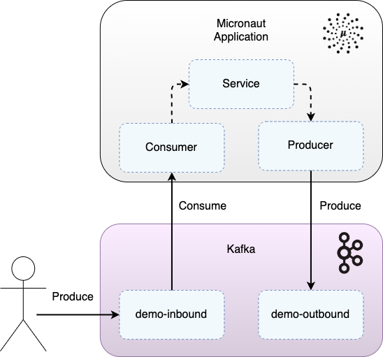

# Micronaut & Java Demo integrating with Kafka

Demo Micronaut application written in Java that integrates with Kafka.

<div style="text-align:center"></div>
<p style="text-align: center;"><I>Figure 1: Micronaut application with Kafka</I></p>

## Running The Demo

The project requires Java 21 to build.

Start the Kafka and Zookeeper Docker containers:
```
docker-compose up -d
```

Build and test the Micronaut application, and then run, with:
```
./gradlew clean test
./gradlew run
```

Check application health:
```
curl localhost:9001/health
```

Jump onto the Kafka docker container and produce a demo-inbound message:
```
docker exec -ti kafka kafka-console-producer \
--topic demo-inbound-topic \
--broker-list kafka:29092
```
Now enter the message:
```
{"id": "2c48eabf-35b0-4f43-8ff4-d123471ecdfb", "data": "my-data"}
```
The demo-inbound message is consumed by the application, which emits a resulting demo-outbound message.

Check for the emitted demo-outbound message:
```
docker exec -ti kafka kafka-console-consumer \
--topic demo-outbound-topic \
--bootstrap-server kafka:29092 \
--from-beginning
```
Output:
```
{"id":"368df778-473b-461c-9cc0-943f18c7b07e","data":"Processed data: my-data"}
```

## Component Tests

The tests demonstrate sending events to a dockerised Kafka that are consumed by the dockerised application, resulting in outbound events being published.

For more on the component tests see: https://github.com/lydtechconsulting/component-test-framework

First ensure the Project module paths are set to `Inherit project compile output path` to ensure the fat jar is built in `./build/libs`.  Then build the Micronaut application jar, followed by the Docker container:
```
./gradlew clean build
docker build -t ct/micronaut-kafka-java:latest .
```

Run component tests:
```
./gradlew componentTest --rerun-tasks
```

Run tests leaving containers up:
```
./gradlew componentTest --rerun-tasks -Dcontainers.stayup=true
```

Note that `--rerun-tasks` is required for subsequent runs when no change has happened between test runs.

## Docker Clean Up

Manual clean up (if left containers up):
```
docker rm -f $(docker ps -aq)
```
